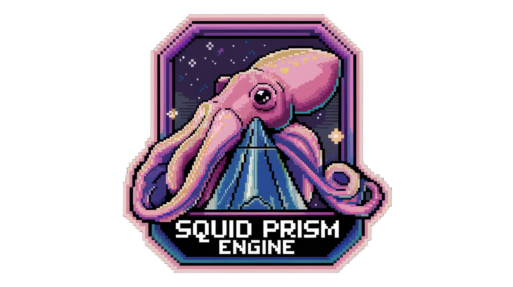

# Squid.Prism.Engine

## 🎮 About

Squid.Prism.Engine is a passion-driven hobby project aimed at creating a flexible voxel-based MMO engine. The core vision is to enable players to craft and share their own unique worlds within an interconnected universe.

## ℹ️  Disclaimer
While there are many Minecraft-inspired projects out there, Squid.Prism.Engine's primary purpose is to serve as a learning platform and architectural proving ground for MMO game development. The voxel-based nature of the engine provides an excellent framework to tackle complex challenges in:

Distributed systems
Real-time networking
World state synchronization
Scalable architecture design
Game engine development

This makes it an ideal testbed for exploring and implementing MMO game architectures, regardless of the visual style chosen.

## 🌟 Vision

The dream behind Squid.Prism.Engine is to create an MMO where creativity knows no bounds. Imagine a universe where:
- Every player can design and build their own world
- Worlds are interconnected through a network of dimensional portals
- Communities can emerge around player-created content
- Stories can unfold across multiple player-crafted dimensions

## 🛠 Technologies

The engine is built using modern technologies and practices:

- **Core Engine**: C# with .NET 9
- **Network Layer**: Custom built networking with support for multiple protocols
- **World Generation**: Voxel-based procedural generation
- **Scripting**: LUA for game logic and world behavior
- **Client**: MonoGame (planned)
- **Database**: TBD
- **Serialization**: High-performance custom serialization

## 🎯 Features (Planned)

- **Voxel Engine**
  - Efficient chunk management
  - Dynamic world loading
  - Advanced lighting system

- **Networking**
  - Scalable MMO architecture
  - Cross-protocol support (UDP, WebSocket)
  - Session management
  - State synchronization

- **World Creation**
  - Procedural world generation
  - Custom biome system
  - Player world editing
  - Portal system between worlds

- **Scripting**
  - LUA scripting engine
  - Custom event system
  - Moddable gameplay mechanics
  - World behavior scripting

## 🚧 Project Status

This project is in active development. As a hobby project, updates and features are added as time permits. Contributors and feedback are welcome!

## 🤝 Contributing

While this is primarily a hobby project, contributions are welcome! Feel free to:
- Report bugs
- Suggest features
- Submit pull requests
- Share ideas and feedback

## 📝 License

[MIT License](LICENSE)

## 🎨 Credits

Created with passion by [@tgiachi](https://github.com/tgiachi)

Special thanks to my cats Orione and Vega for their invaluable supervision and keyboard assistance 🐱
